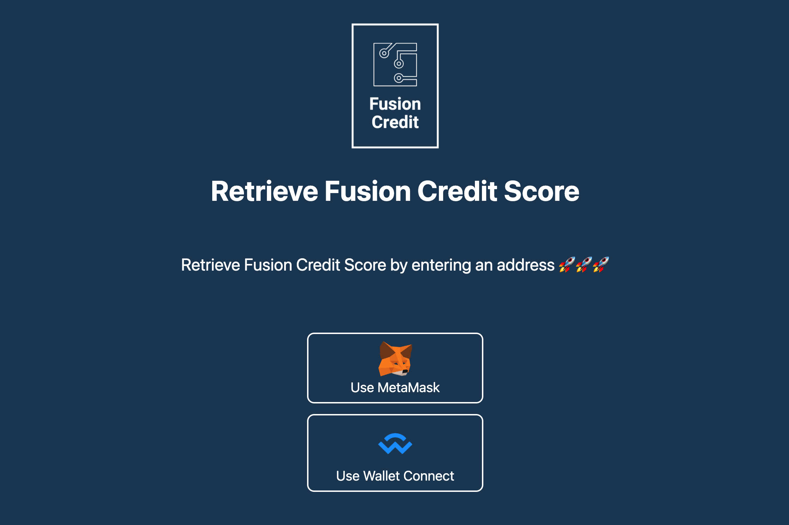
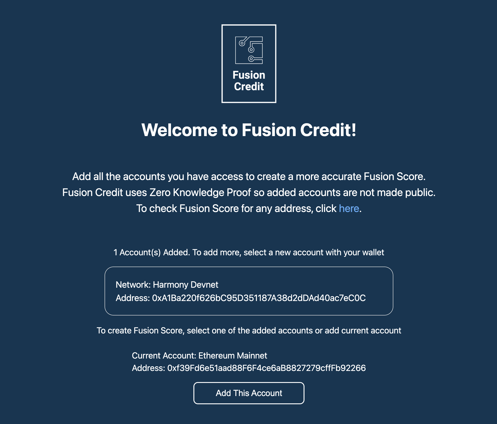
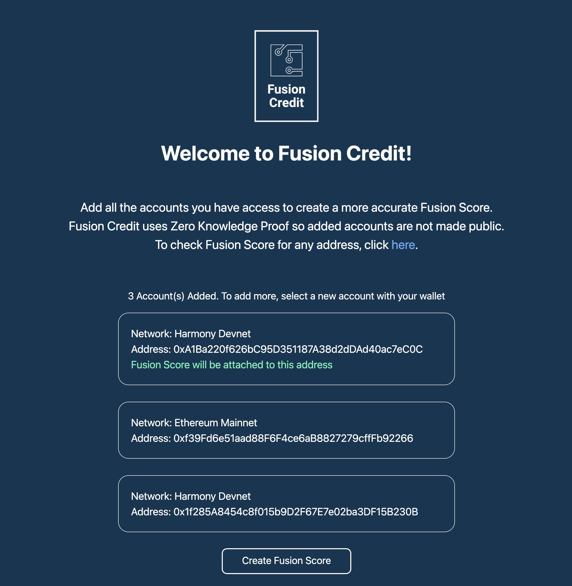
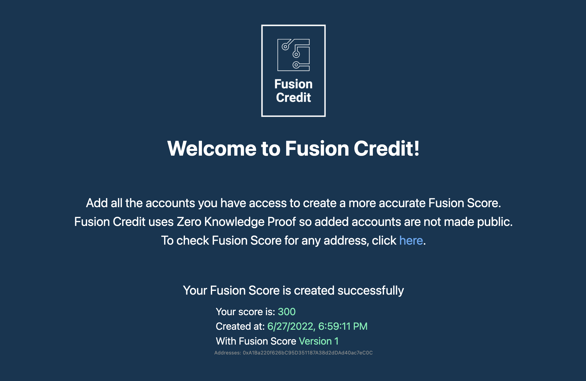
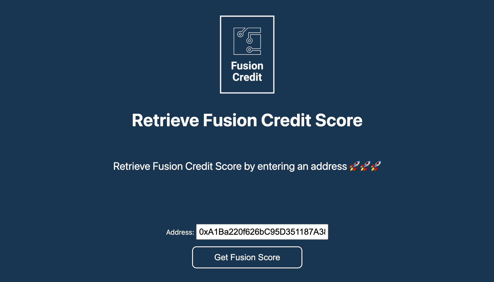

<center></center>

# Fusion Credit
Fusion Credit creates a FusionScore that will represent a universal reputation score with privacy in mind for the #DeFi markets.

FusionScore is based on data from multiple addresses and chains while keeping the account information private. Digital signatures are used to ensure account ownership, and zero knowledge proof is used to hide the account information and ensure the credit score calculation is done correctly. 

This project is currently deployed to [Polygon Mainnet](https://polygonscan.com/) and the frontend is hosted on [Vercel](https://vercel.com/)

Link to client app:

<https://fusion.credit/>

## Setup

### For development
```
$ npm install
$ npm run dev
```

### To build circuit and compile smart contract
```
bash scripts/build_circuit.sh
npm run compile
```

### To deploy smart contract
```
npm run deploy-polygon-main
```

## Project Structure

This project has three main components:

- Zero Knowledge Circuit (`circuits`)
- Ethereum Smart Contract (`contracts`)
- User Interface (`pages`, `components`, `styles`, `public`)

### Zero Knowledge Circuit

The zero knowledge circuit is created with `circom` and is available in the
`circuits` folder.

The `build_circuit.sh` script in the `scripts` folder is used to build the circuit. This script generates the solidity verifier and copies it into the `contracts` folder.

### Ethereum Smart Contract

The `contacts` folders contains the smart contracts written in solidity. 

- `FusionCredit.sol` is the main contract.
- `FusionScoreV1Verifier.sol` is used to verify proof of FusionScore version 1.
- `FusionScoreMockVerifier.sol` is a mocked verifier used for unit test only.

The `compile` npm script is used to compile the ethereum contract and copy the needed ABI files into the `public` folder for the frontend.

### User Interface

Next.js is used to build the user interface. The files are in these folders:

- `pages` UI pages and server side API's
- `components` Reusable UI components
- `styles` Style Sheets
- `public` Images and other files required

The client side is deploy to vercel. Environment variables in the `.env.example` (except first section) needs to be setup in vercel for the application to work.

## Application Screen Shots
Here are some screen shots of the running application

### Initial screen to connect wallet


### Adding a new account/address


### Creating FusionScore


### Successful creation information


### Retrieving score by address

